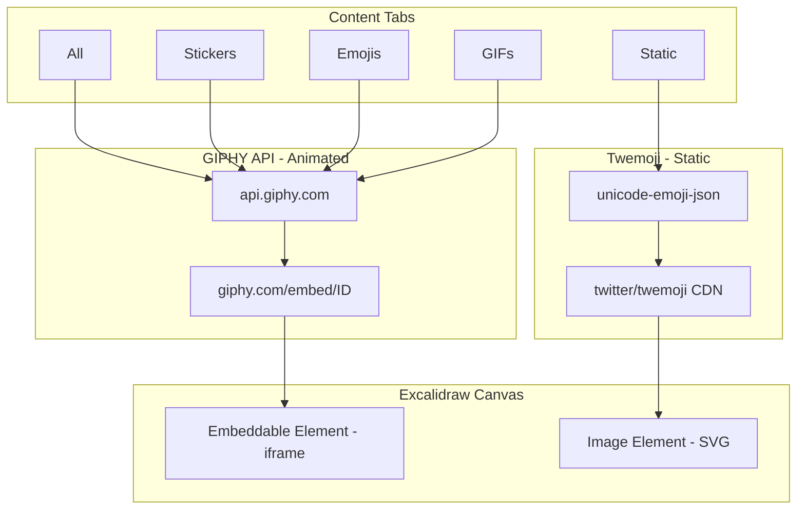

# Stickers & GIFs Sidebar

This document describes the Stickers & GIFs sidebar feature in AstraDraw, powered by GIPHY API and Twemoji.

## Overview

AstraDraw includes a sidebar tab for browsing and inserting GIFs, stickers, and emojis directly onto your canvas. The feature includes:

- **Animated Content (GIPHY)** - GIFs, stickers, and animated emojis play on the canvas
- **Static Emojis (Twemoji)** - High-quality SVG emojis that scale without quality loss
- **Search** - Search for content by keyword
- **Drag & Drop** - Drag items directly onto the canvas
- **Categories** - Browse by content type and emoji categories
- **Localization** - Available in English and Russian

## Content Types

### GIPHY Content (Animated)
- **GIFs** - Animated GIF images
- **Stickers** - Animated stickers with transparent backgrounds
- **Animated Emojis** - GIPHY's animated emoji collection

These are inserted as **embeddable elements** (iframes) that play animation on the canvas.

### Twemoji (Static)
- **Static Emojis** - Twitter's open-source emoji set
- **SVG Format** - Vector graphics that scale infinitely without quality loss
- **Categorized** - Smileys, People, Animals, Food, Travel, Activities, Objects, Symbols, Flags

These are inserted as **SVG image elements** on the canvas.

## Setup

### GIPHY API Key

1. Go to [developers.giphy.com](https://developers.giphy.com/)
2. Create an account or sign in
3. Click "Create an App"
4. Select "API" (not SDK)
5. Copy your API key

Add the GIPHY API key to your `.env` file:

```bash
GIPHY_API_KEY=your_api_key_here
```

The `docker-compose.yml` passes this to the container:

```yaml
- VITE_APP_GIPHY_API_KEY=${GIPHY_API_KEY:-}
```

> **Note:** Twemoji (static emojis) works without any API key.

## Architecture



## Files

| File | Description |
|------|-------------|
| `excalidraw-app/components/Stickers/StickersPanel.tsx` | Main panel component |
| `excalidraw-app/components/Stickers/StickersPanel.scss` | Panel styles |
| `excalidraw-app/components/Stickers/giphyApi.ts` | GIPHY API helper functions |
| `excalidraw-app/components/Stickers/twemojiApi.ts` | Twemoji helper functions |
| `excalidraw-app/components/Stickers/index.ts` | Module exports |

## GIPHY API Endpoints

| Endpoint | Purpose |
|----------|---------|
| `GET /v1/gifs/trending` | Fetch trending GIFs |
| `GET /v1/gifs/search` | Search for GIFs |
| `GET /v1/stickers/trending` | Fetch trending stickers |
| `GET /v1/stickers/search` | Search for stickers |
| `GET /v2/emoji` | Fetch animated emoji collection |

## Twemoji Resources

| Resource | URL |
|----------|-----|
| Emoji Data | `cdn.jsdelivr.net/gh/muan/unicode-emoji-json@main/data-by-group.json` |
| SVG Assets | `cdn.jsdelivr.net/gh/twitter/twemoji@14.0.2/assets/svg/{codepoint}.svg` |

## Usage

1. Open the sidebar by clicking the sticker icon
2. Select a tab: All, Stickers, Emojis, GIFs, or Static
3. For static emojis, use category buttons to browse different emoji groups
4. Search using the search bar
5. Click or drag an item to add it to the canvas

### Insertion Methods

- **Click** - Inserts at the center of the visible viewport
- **Drag & Drop** - Inserts at the drop position on the canvas

## Translations

### English (en.json)

```json
"stickers": {
  "title": "Stickers & GIFs",
  "search": "Search",
  "all": "All",
  "stickersTab": "Stickers",
  "emojis": "Emojis",
  "gifs": "GIFs",
  "staticEmojis": "Static",
  "trending": "Trending",
  "popular": "Popular",
  "noResults": "No results found",
  "loading": "Loading...",
  "error": "Failed to load content",
  "apiKeyMissing": "GIPHY API key is not configured",
  "poweredBy": "Powered by GIPHY",
  "poweredByTwemoji": "Twemoji by Twitter (CC-BY 4.0)",
  "clickToInsert": "Click to add to canvas",
  "dragToInsert": "Drag to canvas or click to insert"
}
```

### Russian (ru-RU.json)

```json
"stickers": {
  "title": "Стикеры и GIF",
  "search": "Поиск",
  "all": "Все",
  "stickersTab": "Стикеры",
  "emojis": "Эмодзи",
  "gifs": "GIF",
  "staticEmojis": "Статичные",
  "trending": "Популярное",
  "popular": "Популярные",
  "noResults": "Ничего не найдено",
  "loading": "Загрузка...",
  "error": "Не удалось загрузить контент",
  "apiKeyMissing": "API ключ GIPHY не настроен",
  "poweredBy": "При поддержке GIPHY",
  "poweredByTwemoji": "Twemoji от Twitter (CC-BY 4.0)",
  "clickToInsert": "Нажмите, чтобы добавить на холст",
  "dragToInsert": "Перетащите на холст или нажмите"
}
```

## Known Limitations

- **GIPHY API rate limits** - Free API has rate limits. Consider paid plan for high traffic.
- **Internet required** - Both GIPHY and Twemoji require internet access.
- **Export limitations** - Embeddable elements (animated GIFs) show as placeholders when exporting to PNG/SVG.

## Attribution

- **GIPHY** - "Powered by GIPHY" attribution displayed per GIPHY terms
- **Twemoji** - Graphics licensed under CC-BY 4.0 by Twitter
